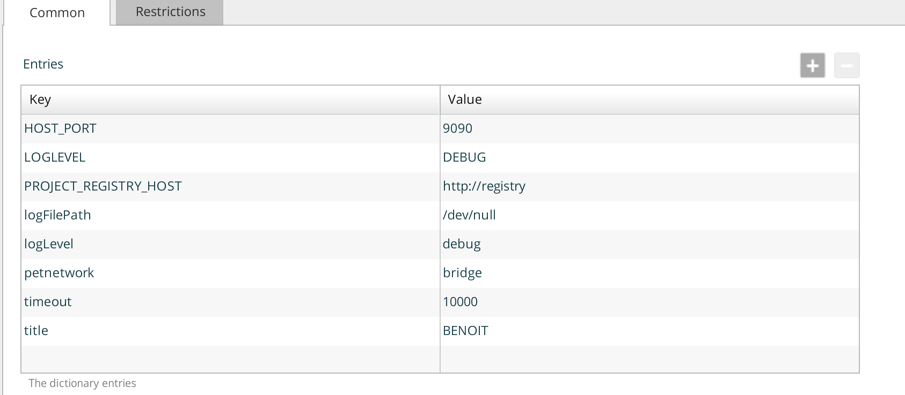

# xld-petclinic-docker
A sample application that shows how to package docker images and deploy them to a Docker Engine and a Kubenetes Cluster using XLDeploy.

## Usage
* set the `docker` environment

```
export DOCKER_TLS_VERIFY="1"
export DOCKER_HOST="tcp://192.168.99.123:2376"
export DOCKER_CERT_PATH="/Users/bmoussaud/.docker/machine/machines/docker-machine-virtualbox-1"
export DOCKER_MACHINE_NAME="docker-machine-virtualbox-1"
# Run this command to configure your shell:
# eval "$(docker-machine env docker-machine-virtualbox-1)"
```

or 

```
eval $(minikube docker-env)
```

* run `mvn clean package` to build the applications and the associated images

To push the images to Docker registries

* local trusted registry (default url is 192.168.99.100:5000)
* docker.hub (edit the ~/.m2/settings.xml)
```
   <server>
        <id>docker-hub</id>
        <username>bmoussaud</username>
        <password>XXXXXXXX</password>
        <configuration>
          <email>bmoussaud@xebialabs.com</email>
        </configuration>
   </server>
  

```


To integrate with *XL Deploy*,
* start XL Deploy version with the default bundled xld-docker-plugin
* run `mvn clean install`. This command `push`the images in the registry
  using a timestamp for version and `import` the XL Deploy DAR file in XL Deploy


The XL Deploy manifest file for the application (Docker):

```
<?xml version="1.0" encoding="UTF-8"?>
<udm.DeploymentPackage version="3.1-20170427-154028" application="PetDocker">
  <application />
  <orchestrator>
    <value>parallel-by-deployment-group</value>
  </orchestrator>
  <deployables>
    <smoketest.HttpRequestTest name="/smoke test">
      <url>http://{{BACK_HOST_ADDRESS}}:{{HOST_PORT}}/petclinic/</url>
      <expectedResponseText>{{title}}</expectedResponseText>
    </smoketest.HttpRequestTest>
    <docker.ContainerSpec name="/petclinic">
      <image>{{REGISTRY_HOST}}/bmoussaud/petclinic:3.1-20172704133956</image>
      <restartPolicyName>on-failure</restartPolicyName>
      <restartPolicyMaximumRetryCount>3</restartPolicyMaximumRetryCount>
      <showLogsAfter>10</showLogsAfter>
      <networks>
        <value>petnetwork</value>
      </networks>
      <links>
        <entry key="petclinic-backend">X</entry>
      </links>
      <portBindings>
        <docker.PortSpec name="/petclinic/exposed-port">
          <hostPort>{{HOST_PORT}}</hostPort>
          <containerPort>8080</containerPort>
        </docker.PortSpec>
      </portBindings>
      <volumeBindings>
        <docker.MountedVolumeSpec name="/petclinic/petclinic-config">
          <volumeName>petclinic-config</volumeName>
          <mountpoint>/application/properties</mountpoint>
        </docker.MountedVolumeSpec>
      </volumeBindings>
    </docker.ContainerSpec>
    <docker.ContainerSpec name="/petclinic-backend">
      <image>{{REGISTRY_HOST}}/bmoussaud/petclinic-backend:1.1-20172704133956</image>
      <restartPolicyName>on-failure</restartPolicyName>
      <restartPolicyMaximumRetryCount>3</restartPolicyMaximumRetryCount>
      <showLogsAfter>10</showLogsAfter>
    </docker.ContainerSpec>
    <smoketest.HttpRequestTest name="/smoke test - ha">
      <url>http://{{FRONT_HOST_ADDRESS}}/petclinic/</url>
      <expectedResponseText>{{title}}</expectedResponseText>
    </smoketest.HttpRequestTest>
    <docker.ContainerSpec name="/ha-proxy">
      <image>{{REGISTRY_HOST}}/eeacms/haproxy:1.6</image>
      <environment>
        <entry key="BACKENDS">petclinic:8080</entry>
        <entry key="constraint">zone==front</entry>
      </environment>
      <restartPolicyName>on-failure</restartPolicyName>
      <restartPolicyMaximumRetryCount>10</restartPolicyMaximumRetryCount>
      <showLogsAfter>10</showLogsAfter>
      <networks>
        <value>petnetwork</value>
      </networks>
      <links>
        <entry key="petclinic">petclinic</entry>
      </links>
      <portBindings>
        <docker.PortSpec name="/ha-proxy/web">
          <hostPort>80</hostPort>
          <containerPort>5000</containerPort>
        </docker.PortSpec>
        <docker.PortSpec name="/ha-proxy/admin">
          <hostPort>1936</hostPort>
          <containerPort>1936</containerPort>
        </docker.PortSpec>
      </portBindings>
      <volumeBindings />
    </docker.ContainerSpec>
    <docker.NetworkSpec name="/petnetwork">
      <tags />
      <driver>bridge</driver>
      <networkOptions />
    </docker.NetworkSpec>
    <docker.Folder name="/petclinic.config" file="/petclinic.config/config">
      <targetContainer>petclinic</targetContainer>
      <targetPath>/application/properties</targetPath>
    </docker.Folder>
  </deployables>
  <applicationDependencies />
  <dependencyResolution>LATEST</dependencyResolution>
  <undeployDependencies>false</undeployDependencies>
</udm.DeploymentPackage>


```

Use the following dictionary to configure your deployed application (fake values!)


