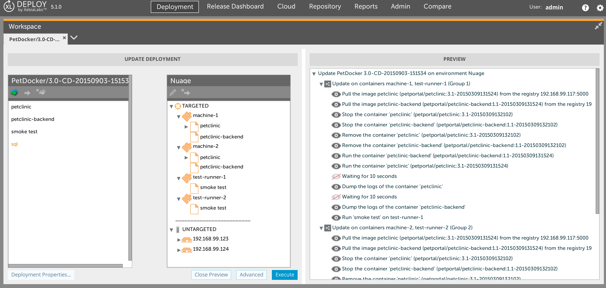

# xld-petclinic-docker
A sample Java application that shows how to package war in a tomcat docker image and deploy them with XLDeploy

## Usage
* set the `docker` environment

```
export DOCKER_TLS_VERIFY="1"
export DOCKER_HOST="tcp://192.168.99.123:2376"
export DOCKER_CERT_PATH="/Users/bmoussaud/.docker/machine/machines/docker-machine-virtualbox-1"
export DOCKER_MACHINE_NAME="docker-machine-virtualbox-1"
# Run this command to configure your shell:
# eval "$(docker-machine env docker-machine-virtualbox-1)"
```

* run `mvn clean package`

To integrate with *XL Deploy*,
* start XL Deploy version 5.0 with the xld-docker-plugin defined here: https://github.com/bmoussaud/xld-docker-plugin
* run `mvn clean install`. This command `push`the images in the registry
  using a timestamp for version and `import` the XL Deploy DAR file in XL Deploy


